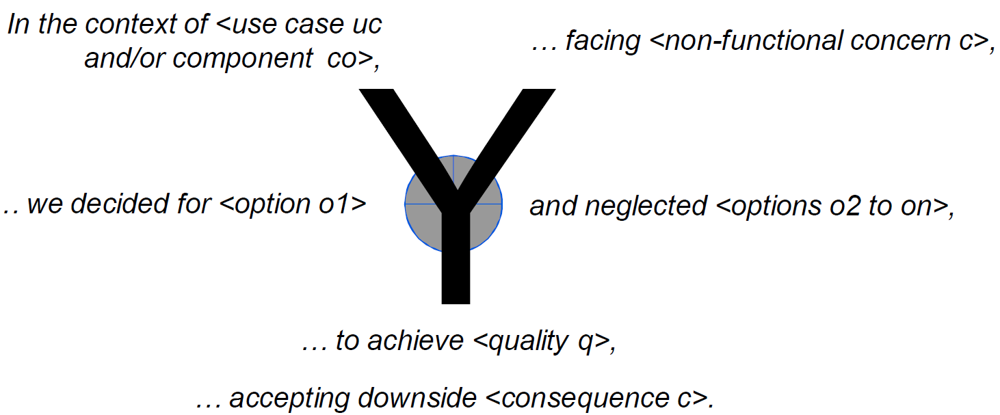

## What and why

**Architecture Decision Record** (ADR) is a document that captures an important architecture decision made along with its context and consequences.

Architecture decision logs are answering the `why?` questions which are important in your designs, for example:
- Why did you decide for Trunk-based branching strategy, rather than GitFlow?
- Why do we use Plumi for infrastructure as code, while Terraform seems more popular and widely adopted?
- Shouldn't we use a relational database instead of DynamoDB(NoSQL) as the source of truth for this system?
...

There are no reasons not to document the key decisions and provide short but solid justifications for your options (patterns, tech stacks etc.) chosen.

## ADR template

I recommend Profession Olaf Zimmermann (ZIO)'s [Y statement template](https://www.ozimmer.ch/practices/2020/04/27/ArchitectureDecisionMaking.html):



- In the context of: functional requirement or an architecture component
- facing: non-functional requirement
- we decided for: decision outcome
- and neglected: alternatives not chosen
- to achieve: the benefits
- accepting that: drawbacks

Example:

```md
---
status: Proposed
date: 2025-05-25
deciders: Member1
---

# AD: The name of the AD

## Context

## Considered Options

### Option 1
### Option 2

## Decision Outcome

## Consequences

```

## Best practices

AWS published a blog: [Master architecture decision records (ADRs): Best practices for effective decision-making](https://aws.amazon.com/blogs/architecture/master-architecture-decision-records-adrs-best-practices-for-effective-decision-making/) about the best practices of ADR recently, which is very much worth reading.

Based on my own experience, I have resonance about the following points:

- **Centralize storage** - Store ADRs in a central location accessible to all team members, regardless of their team affiliation. This practice promotes transparency and makes sure that architectural decisions are really available to everyone involved.

- **Promote ownership** - Each team member should be empowered to create and own ADRs.
  - This practice distributes architectural research work among teams members and offloads that work from architect or team lead.
  - It also fosters a sense of ownership in the decision-making process.

- **Keep ADR meetings short and focused** - Effective ADR meetings should be time-bound and keep them 30-45 minutes maximum. This focused approach keeps discussions on tract and participants engaged throughout the process

- **Maintain a cross-functional yet lean participant list** - Invite representatives from each tem that might be affected by the architectural decisions but thrive to keep the total number of participants below 10.

- **Focus on a single decision** - Concentrating on one decision at a time simplifies the decision-making process so that participants can thoroughly evaluate the impact.

- **Embrace team collaboration**: The author must own the document and gather feedback from all affected teams before finalizing the decision.

- **Address comments and resolve feedback** - Resolve all comments, either by incorporating changes or by discussing and reaching a consensus with the comment author.

## References

- [Architectural Decisions — The Making Of](https://www.ozimmer.ch/practices/2020/04/27/ArchitectureDecisionMaking.html)
- [Master architecture decision records (ADRs): Best practices for effective decision-making](https://aws.amazon.com/blogs/architecture/master-architecture-decision-records-adrs-best-practices-for-effective-decision-making/)
- [Architecture decision record (ADR) - templates](https://github.com/joelparkerhenderson/architecture-decision-record?tab=readme-ov-file) 