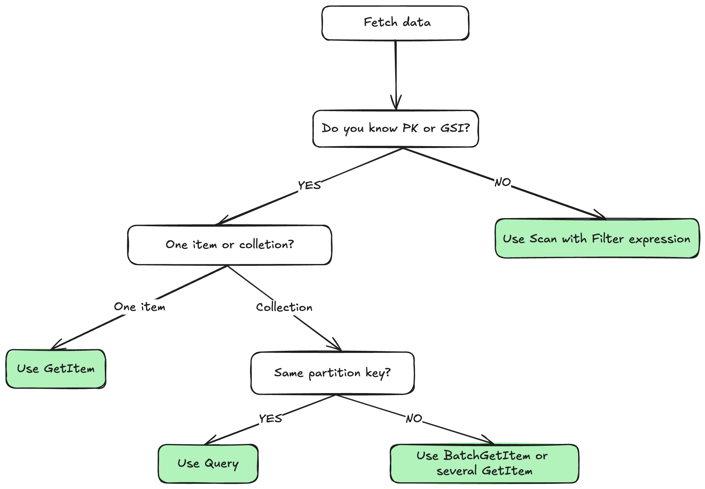

## Query VS Scan

In DynamoDB, Query and Scan are two different operations for retrieving data, `Scan` is canning through the whole table looking for items that match the filter criteria, `Query` is performing a direct lookup to a selected partition based on primary or secondary index.

Let's use the following DynamoDB table named `Users` with the following schema as an example:

| Attribute  | Type   |
| ---------- | ------ |
| id         | String |
| name       | String |
| email      | String |
| type       | String |
| created_at | String |

- Partition key: `id`
- Sort key: `created_at`

- GSI: `type_index`:
  - partition key `type`
  - projection: `id`, `name`, `email`

## Query

Retrieves items based on partition key and optionally sort key values.

- Must specify a partition key value
- Can optionally filter by sort key using comparison operators (`=, <, >, <=, >=`, begins_with, between)
- Returns items in sort key order (ascending by default, can be reversed)
- Only searches within a single partition

Performance: Highly efficient because it directly accesses the relevant partition and uses indexes.

TypeScript query:

```ts
// Create the DynamoDB client
const ddbClient = new DynamoDBClient({ region: "us-west-2" });
const documentClient = DynamoDBDocumentClient.from(ddbClient);

async function queryUsersByType(type: string) {
  const command = new QueryCommand({
    TableName: "Users",
    IndexName: "type_index",
    KeyConditionExpression: "type = :type",
    ExpressionAttributeValues: { ":type": type },
  });

  const response = await documentClient.send(command);
  return response.Items;
}

queryUsersByType("admin").then(console.log).catch(console.error);
```

## Scan

Examines every item in a table or index.

- Reads through all items in the table/index
- Can apply filter expressions to return only matching items
- Processes items in parallel across multiple segments
- Returns items in no particular order

Performance: Less efficient for large tables as it examines every item, consuming more read capacity.

### Scan on table vs Scan on index

**Data examined**:
- Scan table: Reads all items with all attributes from the main table
- Scan index: Only reads the projected attributes defined in the GSI (typically just the key attributes plus any projected attributes)

**Size**:
- Scan table: Processes the full dataset
- Scan index: Processes a subset of data (only projected attributes), so generally smaller and faster

**Attributes available**:
- Scan table: All item attributes are available
- Scan index: Only projected attributes are available (you might need to do additional queries to get full item details)

Use case example: If you want to find all members regardless of type but only need their type and createdAt, scanning the GSI would be more efficient than scanning the main table since you're working with less data per item.
The GSI scan is essentially a more efficient way to examine all items when you only need the projected attributes, while the table scan gives you complete item data but at a higher cost.


Scan on table example (TypeScript):

```ts
// Scan on the table
const ddbClient = new DynamoDBClient({ region: "us-west-2" });
const documentClient = DynamoDBDocumentClient.from(ddbClient);

async function scanUsersByType(type: string) {
  const command = new ScanCommand({
    TableName: "Users",
    FilterExpression: "#type = :type",
    LIMIT: 100, // optional
    ProjectionExpression: "id, #type, #name, email", // optional
    ExpressionAttributeValues: { ":type": type },
    ExpressionAttributeNames: { "#type": "type", "#name": "name" }, // name and type are reserved words
  });

  const response = await documentClient.send(command);
  return response.Items;
}

scanUsersByType("admin").then(console.log).catch(console.error);
```

Scan on index example (TypeScript):

```ts
// Scan on the index
const ddbClient = new DynamoDBClient({ region: "us-west-2" });
const documentClient = DynamoDBDocumentClient.from(ddbClient);

async function scanUsersByType(type: string) {
  const command = new ScanCommand({
    TableName: "Users",
    IndexName: "type_index",
    FilterExpression: "#type = :type",
    LIMIT: 100, // optional
    ProjectionExpression: "id, #type, #name, email", // limited to projected attributes of the index only
    ExpressionAttributeValues: { ":type": type },
    ExpressionAttributeNames: { "#type": "type", "#name": "name" }, // name and type are reserved words
  });

  const response = await documentClient.send(command);
  return response.Items;
}

scanUsersByType("admin").then(console.log).catch(console.error);
```

## Summary

- Generally speaking, you should always favor `Query` over `Scan` when it's possible, as it is more efficient, cost-effective, and faster for targeted data retrieval.
- Use Scan only when you need to examine all items or don't know the partition key of the values you're looking for.
- The filter expression is applied after the data is retrieved, so it doesn't reduce the read capacity units consumed by the operation.
- Always consider your access patterns, using indexes effectively can help you avoid the need for scans
- Consider the use of projections to limit the amount of data returned by your queries and scans, which can help reduce costs and improve performance.

 