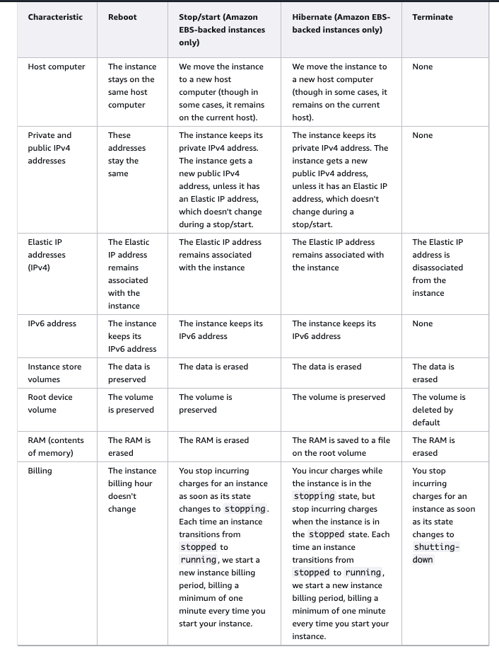

### EC2 instance types

- General Purpose:
  - provide a balance of compute, memory and networking resources
  - ideal for applications that use these resources in equal proportions
  - use cases:
    - web servers
    - code repositories
  - m7g.large, m7gd.16xlarge(M for general purpose, T for burstable general purpose)

- Compute Optimized
  - ideal for compute bound(intensive) applications that benefit from high performance processors
  - use cases:
    - batch processing workloads
    - media transcoding
    - high performance web servers
    - high performance computing
    - machine learning
  - c7g.2xlarge, c7gd.metal(C for compute)

- Memory Optimized
  - designed to deliver fast performance for workloads that process data sets in memory (memory-intensive workloads)
  - use cases:
    - high performance relational/non-relational databases,
    - in-memory caches
    - real-time big data analytics
  - r7gd.xlarge, r8g(R for RAM)

- Storage Optimized
  - designed for workloads that require high, sequential read and write access to very large data sets on local storage
  - optimized to deliver tens of thousands of low-latency, random I/O operations per second (IOPS) to applications
  - use cases (I/O intensive applications):
    - High frequency online transaction processing (OLTP) systems
    - Relational & NoSQL databases
    - Cache for in-memory databases (for example, Redis)
    - Data warehousing applications
    - Distributed file systems
  - i4g.large, i4g.16xlarge. (I for IO)

- Naming convention: `m5.2xlarge`
  - m: instance class
  - 5: generation of the instance (AWS improves them over time)
  - 2xlarge: size within the instance class

### Security Groups

- Security groups are the fundamental of network security in AWS
- They control how traffic is allowed into or out of our EC2 instances
- They only contain `allow` rules
- Security groups rules can reference by IP or by security group

- Security groups are acting as a firewall on EC2 instances
- They regulate:
  - access to ports
  - authorized IP ranges - IPv4 and IPv6
  - control of inbound network (from other to the instance)
  - control of outbound network (from the instance to other)

- Good to know about security groups:
  - can be attached to multiple instances
  - locked down to a region/VPC combination
  - does live outside the EC2 - if traffic is blocked, the EC2 instance won't see it
  - it's good to maintain one separate security group for SSH access
  - if your application is not accessible (timeout), then it's a security group issue
  - if your application gives a `connection refused` error, then it's an application error or the application is not launched
  - by default, all inbound traffic is **blocked**, all outbound traffic is **authorized**.

- Classic ports to know
  - 22 = SSH (Secure Shell) - log into a Linux instance
  - 21 = FTP (File Transfer Protocol) - upload files into a file share
  - 22 = SFTP (Secure File Transfer Protocol) - upload files using SSH
  - 80 = HTTP - access unsecured websites
  - 443 = HTTPS - access secured websites
  - 3389 = RDP (Remote Desktop Protocol) - log into a Windows instance

- Connect EC2 instance
  - SSH (the key pair can only be attached to the instance during its launch/creation)

  ```shell
      ssh -i DemoKeyPair.pem ecs-user@3.105.21.197
  ```

  - EC2 instance connect (only the user is required)

- EC2 instance role
  - create an IAM role
  - EC2 instance => Actions => Security => Modify IAM role

- Security group self referencing
  - you can configure a security group to permit inbound connections from itself (that is, the security group has its own ID as the source of the inbound connection)
  - it enables any EC2 instances that is associated with the security group to communicate with any other EC2 instance that is associated with the same security group (on the given port)

### EC2 instances purchasing options

- EC2 On Demand
  - pay for what you use
  - has the highest cost but no upfront payment
  - no long-term commitment
  - recommended for short-term and un-interrupted workloads, where you cannot predict how the application will behave

- EC2 Reserved Instances
  - up to 72% discount compared to on-demand
  - you reserve a specific instance attributes (instance type, region, tenancy, OS)
  - reserve period -- 1 year (+discount) or 3 years (++discount)
  - payment options - no upfront(+discount), partial upfront(++discount), all upfront(+++discount)
  - reserved instance's scope - Regional or Zonal (reserve capacity in an AZ)
  - recommend for steady-state usage applications (for example: database)
  - you can buy and sell in the Reserved Instance Marketplace
  - convertible reserved instance:
    - can change the EC2 instance type, instance family, OS, scope and tenancy
    - up to 66% discount

- EC2 Savings Plan
  - get a discount based on long-term usage (up to 72% discount)
  - commit to a certain type of usage ($10/hour for 1 or 3 years)
  - usage beyond EC2 Savings Plan is billed at the on-demand price
  - Plan types:
    - Compute Savings Plan:
      - up to 66% discount
      - applies to EC2 instance usage, regardless of instance family, instance size, region, OS, or tenancy.
      - applies to Fargate and Lambda usage
    - EC2 instance Savings Plan
      - up to 72% discount
      - a commitment to a specific instance family in a chosen AWS region (for example: M5 in Sydney)
      - you can change your instance size within the instance family, change OS or tenancy
    - SageMaker Savings Plan

- EC2 Spot Instances
  - up to 90% discount compared to on-demand, the most cost-efficient instances in AWS
  - instances that you can _lose_ at any pont of time if your max price is less than the current spot price
  - useful for workloads that are resilient to failure
    - batch jobs
    - data analysis
    - image processing
    - any distributed workloads
    - workloads with a flexible start and end time
  - not suitable for critical jobs or databases

- EC2 Dedicated Hosts
  - a physical server with EC2 instance capacity fully dedicated to your use, most expensive option
  - purchasing options
    - on-demand: pay per second for active dedicated host
    - reserved: 1 or 3 years (no upfront, partial upfront, all upfront)
  - useful for
    - softwares that have complicated licensing model (BYOL: Bring Your Own License)
    - companies that have strong regulatory or compliance needs

- EC2 Dedicated Instances
  - instances run on a hardware that's dedicated to a single AWS account
  - might share hardwares with other instances from the same AWS account that are not Dedicated Instances
  - if you stop and start a Dedicated Instance, it might not un on the same host
  - provide limited support for Bring Your Own Licence (BYOL)

- EC2 Capacity Reservation
  - allows to reserve compute capacity for EC2 instances in a specific AZ
  - useful when you have strict capacity requirements, and are running business-critical workloads that require capacity assurance
  - ensure that you'll always have access to the EC2 capacity you've reserved as long as you need it

> We recommend Savings Plans over Reserved Instances. Savings Plans are the easiest and most flexible way to save money on your AWS compute costs and offer lower prices (up to 72% off) just like Reserved Instances.

- Spot Fleet
  - a set of Spot Instances + (optional) On-Demand Instances
  - allows to automatically request Spot Instances with the lowest price
  - the Spot Fleet will try to meet the target capacity with price constraints
    - define possible lunch pools: instance type, OS, AZ
    - can have multiple launch pools, so that the fleet can choose
    - stops launching instances when reaching capacity or max cost
  - strategies to allocate Spot Instances
    - priceCapacityOptimized (recommended): pools with highest capacity available, then select the pool with the lowest price (best choose for most workloads)
    - lowestPrice: from the pool with the lowest price (cost optimization, short workload)
    - diversified: distributed across all pools (great for availability, long workloads)
    - capacityOptimized: pool with the optimal capacity for the number of instances

## Private IP, public IP, Elastic IP

- Networking has two sorts of IPs, IPv4 and IPv6:
  - IPv4: 1.160.10.254
  - IPv6: 3fee:1200:4555:3:200:f9ee:fe22:88cf
  - IPv4 is still the most common format used online
  - IPv6 is newer and solves problems for the Internet of Things (IoT)
  - IPv4 allows for 3.7 billion different addresses in the public space

- Public IP
  - public IP means the machine can be identified on the internet
  - must be unique across the whole web (not two machines can have the same public IP)
  - can be geo-located easily

- Private IP
  - private IP means the machine can only be identified on a private network
  - the IP must be unique across the private network, but two different private networks (two companies) can have the same IPs
  - machines connect to the internet using an internet gateway (a proxy)
  - only a specified range of IPs can be used as a private IP

- Elastic IP
  - for EC2 instance, if you stop and then start the instance, the public IP will change
  - if you need a fixed public IP for your instance, you need an Elastic IP
  - an Elastic IP is a public IPv4 IP you own as long as you don't delete it
  - you can attach to one instance at a time

  - With an Elastic IP, you can mask the failure of an instance or software by rapidly remapping the address to another instance in you account
  - You can only have 5 Elastic IP in your account
  - **Overall, try to avoid using Elastic IP**
    - they often reflect poor architectural decisions
    - instead, use a random public IP and register a DNS name to it
    - or, use a load balancer and don't use a public ip

## Placement Groups

- You can launch a group of interdependent EC2 instances into a placement group to influence their placement
- Placement strategies
  - Cluster
    - packs instances close together inside an AZ; enables workloads to achieve the low-latency network performance necessary for tightly-coupled node-to-node communication that is typically of HPC applications
    - **pros**: instances enjoy a higher per-flow throughout limit for TCP/IP traffic
    - **cons**: if the AZ fails, all instances fails at the same time
    - use cases: when the majority of the network traffic is between the instances of the group
      - big data job that needs to complete fast
      - application that needs extremely low latency and high network throughput
      - High Performance Computing applications
  - Partition
    - spreads your instances across logic partitions such that groups of instances in one partition do not share the underlying hardware with groups of instances in different partitions.
      - up to 7 partitions per AZ; can span across multiple AZs in the same region; up to 100 of EC2 instances
      - help reduce the likelihood of correlated hardware failures for your application since the instances in one partition do not share the underlying hardware with instances in other partitions
      - use cases: can be used to deploy large distributed and replicated workloads such as Hadoop, Cassandra and Kafka
  - Spread
    - strictly places a small group of instances across distinct underlying hardware to reduce correlated failures (each instance is placed on distinct hardware)
    - use case
      - recommended for applications that have a small number of critical instances that should be kept separate from each other
- Placement groups are optional and no charge
- An instance can be placed in one placement group at a time, you cannot place an instance in multiple placement groups
- If you don't launch your instances into a placement group, EC2 tries to place the instances in such a way that all of your instances are spread out across the underlying hardware to minimize correlated failures
- Summary:
  - cluster: high performance, low latency, high network
  - partition: distributed workloads
  - spread: critical applications

## Elastic Network Interfaces (ENI)

- A logical component in a VPC that represents a virtual network card
- Can have the following attributes
  - a primary private IPv4, one more secondary IPv4 from the IPv4 address range of your VPC
  - one Elastic IP (IPv4) per private IPv4
  - one public IPv4
  - one or more security groups
  - a MAC address
- You can create ENI independently and attach them on the fly (move them) on EC2 instances for failover
- Bounds to a specific AZ

## EC2 instance life cycle

- https://docs.aws.amazon.com/AWSEC2/latest/UserGuide/ec2-instance-lifecycle.html



- Why use EC2 hibernate
  - the in-memory (RAM) state is preserved
  - the instance boot is much faster (the OS is not stopped/restarted)
  - you can only enable hibernate during the launch of the instance
  - under the hood: the RAM state is written to a file in the root EBS volume
  - the root EBS volume must be encrypted
  - use cases:
    - long-running processing
    - saving the RAM state
    - services that take time to initialise

- Instance states
  - running: the instance is running and ready for use
  - stopped: the instance is shutdown and cannot be used, can be restarted at any time
  - terminated: the instance has been permanently deleted and cannot be restarted
  - Pending: the instance is preparing to enter the `running` state
    - first launch -> pending -> running
    - stopped (restarted) -> pending -> running
  - stopping: the instance is preparing to be stopped
    - running -> stopping -> stopped
  - shutting-down: the instance is preparing to be terminated
    - running -> shutting-down -> terminated

## EC2 billing

- Not billed
  - pending
  - stopping
  - stopped
  - shutting-down
  - terminated

- Billed
  - running
  - stopping for hibernate

**Note**:

- If you hibernate an instance, you're **billed** while the instance is in the stopping state (preparing to hibernate).
- Reserved Instances that applied to terminated instances are **billed** until the end of their term according to their payment option.
