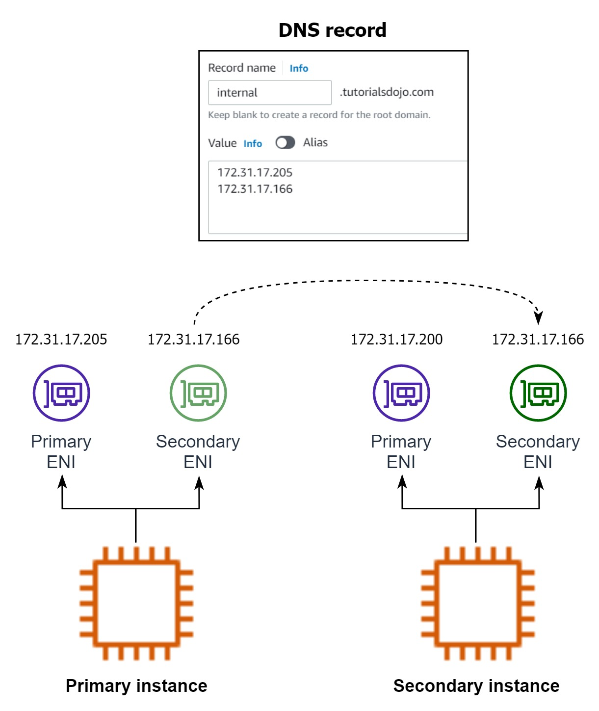

## Elastic Network Interface (ENI)

- An **Elastic Network Interface (ENI)** is a virtual network interface that you can attach to an Amazon EC2 instance in your Virtual Private Cloud (VPC). ENIs are fundamental building blocks for your networking setup in AWS and offer flexibility in managing network configurations for your instances.
- It is a logical networking component in the VPC that represents a virtual network card
- You can only attach a network interface to instances in the same AZ
- When you move a network interface from one instance to another, network traffic is redirected from the original instance to the new instance

- **Key features**:
  - _Multiple ENIs per Instance_: Each EC2 instance can have multiple ENIs attached, allowing for complex networking configurations.
  - _Persistent Attributes_: Attributes like private IP addresses, security groups, and MAC addresses associated with an ENI persist independently of the lifecycle of the EC2 instance it's attached to.
  - _Mobility:_ ENIs can be detached from one instance and attached to another within the same Availability Zone (AZ), facilitating failover and maintenance without changing network configurations.

- **Network Interface Concepts**:
  - _Primary network interface_: Each instance has a default network interface, called the _primary network interface_. You can't detach a primary network interface from an instance.
  - _Secondary network interfaces_: You can create and attach secondary network interface to the instance
  - _IPv4 addresses for network interfaces_: When you launch an EC2 instance into an IPv4-only or dual stack subnet, the instance receives a primary private IP address from the IPv4 address range of the subnet. You can also specify additional private IPv4 addresses, known as secondary private IPv4 addresses. Unlike primary private IP addresses, secondary private IP addresses can be reassigned from one instance to another.
  - _Elastic IP addresses for network interfaces_: You can associate **one** Elastic IP address with each private IPv4 address. If you disassociate an Elastic IP address from a network interface, you can release it or associate it with a different instance.

- **How to differentiate primary and secondary ENIs**:
  - Primary ENI:
    - Device index: 0
    - Automatically created when you launch an EC2 instance.
    - Cannot be detached while the instance is running.
    - Associated with the instance's primary private IPv4 address.
    - Holds the instance's public IPv4 address (if assigned).
    - Contains essential attributes such as the MAC address and security groups.
  - Secondary ENI
    - Device index: 1 and above
    - Can be attached or detached from the instance while it is running (depending on the instance type and configuration).
    - Used for additional network interfaces, such as for management, monitoring, or application traffic.
    - Each can have its own set of private IPv4 addresses, security groups, and other network configurations.

- **Use secondary ENI for failover**:
  

---

## Tests

- **Question:** A company is running an application on a Spot EC2 instance inside a private subnet. The application is reachable via a domain name that maps to the private IPv4 address. How to increase network availability by allow the traffic flow to resume in another instance if the primary instance is terminated?
- **_Answer_**: Create a secondary elastic network interface and point its private IPv4 address to the application's domain name. Attach the new network interface to the primary instance. If the primary instance goes down, move the secondary network interface to another instance.

- **_Note_**: Route 53 is a public DNS service, and it requires public IP addresses or Elastic IP addresses (which are also public) to create DNS records. So you have to use private hosted zone from Route 53 to point a private IPv4 address to a domain name.

---

- **Question**: A company plans to run a monitoring application on an Amazon EC2 instance in a VPC. Connections are made to the EC2 instance using the instance's private IPv4 address. A solutions architect needs to design a solution that will allow traffic to be quickly directed to a standby EC2 instance if the application fails and becomes unreachable.
- **Answer**: Attach a secondary elastic network interface to the EC2 instance configured with the private IP address. Move the network interface to the standby EC2 instance if the primary EC2 instance becomes unreachable.
