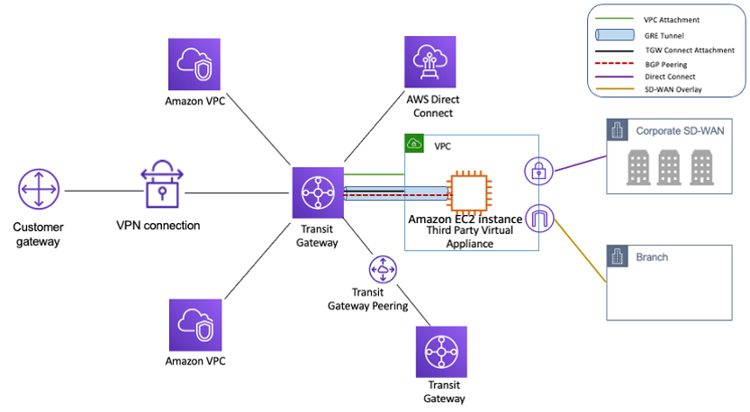

## Site-to-Site VPN connections

- Site-to-Site VPN: setting up a secure connection between your on-premises network or another cloud environment and your AWS VPC
- Steps:
  - create a _Virtual Private Gateway_ in the VPC and attach it to your VPC
    - Virtual Private Gateway: the concentrator on the AWS side of the VPN
  - create a _Customer Gateway_ in the VPC
    - Customer Gateway: represents your on-premise VPN device
    - need to set the static public IP address of your on-premise VPC device
  - create the VPN connection
    - establish the VPC connection between the Virtual Private Gateway and the Customer Gateway
    - download the VPN configuration
  - configure the on-premises VPN device
    - apply the VPN configuration settings to your on-premise VPN device as per the vendor-specific instructions
  - update the VPC route tables
    - add a route to your on-premise network, specifying the Virtual Private Gateway as the target
    - need to enable the _Route Propagation_ for the route

**Test**

- A company needs to establish a Site-to-Site VPN connection to integrate the on-premises database with the current AWS workload in the VPC. What needs to be configured outside of the VPC?
- _Answer_: an Internet-routable IP address (static) of the customer gateway's external interface for the on-premises network.

## Direct Connect (DX)

![[direct_connect.png]]

- Provides a dedicated **private** connection from a remote network to your VPC
- Connections must be set up between your DC and AWS Direct Connect locations
- VPC side
  - need to setup a Virtual Private Gateway (VGW)
- AWS Direct Connect locations
  - AWS Direct Connect Endpoint (AWS Cage)
  - Customer or partner router (customer or partner cage)
- Corporate data center
  - customer router/firewall

- Private virtual interface (EC2 instances): customer router/firewall => customer/partner router => AWS Direct Connect Endpoint => VPC Virtual Private Gateway
- Public virtual interface (S3): customer router/firewall => Customer/partner router => AWS Direct Connect Endpoint

- Use cases
  - increase bandwidth throughput
  - work with large data sets with lower cost (without public Internet)
  - more consistent network experience - applications using real-time data feeds
  - hybrid environments (both on-premise and cloud)

- Direct Connect Gateway
  - to setup a Direct Connect to one or more VPC in many different regions (same account)

- Connection Types
  - dedicated connections: 1Gbps, 10Gbps, 100Gbps capacity
  - hosted connections: 50Mbps, 500Mbps to 10Gbps
  - it often takes longer than 1 month to establish a new connection

- Encryption
  - data is not encrypted but it's private
  - Direct Connect + VPN provides an IPsec-encrypted private connection

- Resiliency
  - high resiliency
    - multiple locations, one connection per location
    - maximum resiliency
      - multiple locations, two connections per location

- Backup
  - Direct Connection + backup Direct Connection: expensive
  - Direct Connection + backup Site-to-Site VPC

## Transit Gateway

- Amazon VPC Transit Gateways is a network transit hub used to interconnect virtual private clouds (VPCs) and on-premises networks. As your cloud infrastructure expands globally, inter-Region peering connects transit gateways together using the AWS Global Infrastructure.

  

- You can attach the following:
  - One or more VPCs
  - An Direct Connect gateway
  - A peering connection with another transit gateway
  - A VPN connection to a transit gateway
- Key characteristics:
  - **scalability**: handles thousands of VPCs and connections without significant performance degration
  - **centralization**: offers a single point of connectivity, simplifying routing and monitoring
  - **interoperability**: supports both AWS and non-AWS environments through various connection types
- Use cases:
  - hybrid cloud architectures: connect on-premises data centers with AWS environments seamlessly
  - multi-region deployments: facilitate communication between resources spread across different AWS regions.
  - enterprise networking: simplify the networking infrastructure for large organizations with multiple VPCs and subsidiaries.
  - microservices architectures: efficiently manage network traffic between numerous microservices deployed in different VPCs.
  - data center extension: extend on-premises data centers to the cloud without overcomplicating network configurations.

## Traffic Mirroring

- Allows to capture and inspect network traffic in your VPC
  - source: ENIs
  - target: an ENI or a Network Load Balancer
- Use cases:
  - content inspection, threat monitoring, trouble shooting

## IPv6

- Every IPv6 address in AWS is public and Internet-routable (no private range)
- examples:
  - 1111:db8:3333:4444:5555:6666:7777:8888
  - :: => all 8 segments are zero
  - ::1234:4567 => the first 6 segments are zero
  - 1234:5678:: => the last 6 segments are zero
- IPv4 cannot be disabled for VPCs and subnets
- If you cannot launch an EC2 instance in your subnet
  - because there are no available IPv4 in the subnet
  - you should create a new IPv4 CIDR in the subnet

- Enable IPv6
  - edit CIDR of your VPC, add IPv6 CIDR
    - this will automatically add a route to all route tables
  - edit CIDR of your subnets

## Egress only Internet Gateway

- Allows outbound communication over IPv6 from instances in the VPC to the Internet, but not allow inbound communications
- Similar:
  - NAT for IPv4: instance => NAT Gateway => Internet Gateway => Internet
  - Egress only Internet Gateway for IPv6: instance => EIGW => Internet

## Costs

- Ingress traffic: typically free
- Egress traffic: not free
- Use private IP instead of public IP for good savings and better network performance
- Try to keep as much internet traffic within AWS to minimize costs
- Direct Connect locations that are co-located in the same AWS region results in lower cost for egress network

## Summary

- CIDR: IP range
- VPC (Virtual Private Cloud): define a list of IPv4 & IPv6 CIDR
- Subnets: tied to an AZ, within a VPC, define a CIDR
- Internet Gateway: at the VPC level, provide IPv4 and IPv6 Internet access
- Route table: must be updated to add routes from subnets to IGW, VPC peering connections, VPC Endpoints
- Bastion Host: public EC2 instance to SSH into, that has SSH connectivity to EC2 instances in private subnets
- NAT Gateway: managed by AWS, provides scalable Internet access to private EC2 instances when the target is an IPv4 address

- NACL: at the subnet level, stateless, inbound and outbound rules
- Security groups: at the EC2 instance level, stateful
- VPC peering: connect two VPCs with no overlapping CIDR, non-transitive
- VPC endpoints: provides private access to AWS services (S3, DynamoDB, CloudFormation) within a VPC
- VPC flow logs: can be setup at the VPC/subnet/ENI level, for ACCEPT/REJECT traffic, helps identifying attacks, analyze using Athena/CloudWatch Logs Insights
- Site-to-Site VPN: setup a Customer Gateway on DC, a Virtual Private Gateway on VPC, and Site-to-Site VPN over public Internet
- AWS VPN CloudHub: hub-and-spoke VPN model to connect your sites

- Direct Connect: setup a virtual private gateway on VPC, and establish a direct private connection to an AWS Direct Connect Location
- Direct Connect Gateway: setup a Direct Connect to many VPCs in different AWS regions
- AWS PrivateLink/VPC Endpoint Service:
  - connect services privately from your service VPC to customer VPC
  - doesn't need VPC peering, public Internet, NAT Gateway, or Route Tables
  - must be used with Network Load Balancer & ENI
- Transit Gateway: transitive peering connections for VPC, VPN & DX
- Traffic Mirroring: copy network traffic from ENIs for further analysis
- Egress-only Internet Gateway: like a NAT Gateway, but for IPv6
