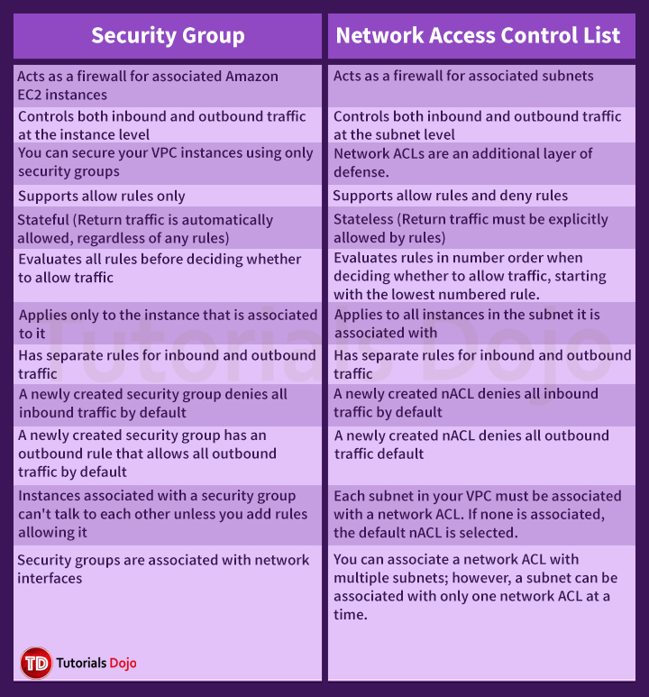
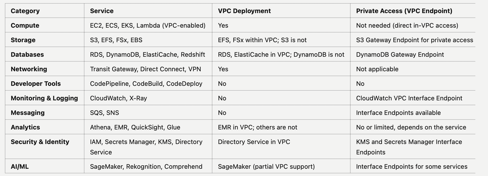

# VPC

## CIDR

- CIDR: Classless Inter-Domain Routing, a method for allocation IP addresses
  - base IP: 10.0.0.1, represents an IP contained in the range, network address
  - subnet mask: how many bits can change in the IP (host bits)
  - for example: 10.24.8.25/24 => 8 (=32-24) bits can change

- private IP
  - 10.0.0.0/8 (10.0.0.0 to 10.255.255.255): a bit networks
  - 172.16.0.0/12 (172.16.0.0 to 172.31.255.255): AWS default VPC in the range
    - base ip: 172.16.0.0, netmask: 255.240.0.0, wildcard bits: 172.15.255.255 => last ip: 172.31.255.255
  - 192.168.0.0/16 (192.168.0.0 to 192.168.255.255): home networks

- public IP
  - all the rest of the IP addresses on the Internet are public

- https://www.ipaddressguide.com/cidr

## VPC

A VPC is a virtual network that closely resembles a traditional network that you'd operate in your own data center.

When you create a VPC:

- you must specify an IPv4 CIDR block for the VPC
- the allowed block size is between a /16 netmask (65536 IP addresses) and /28 netmask (16 IP addresses).
- you can optionally associate additional IPv4 CIDR blocks and one or more IPv6 CIDR blocks (maximum 5 CIDR blocks, which is adjustable)

VPC is private, only private IPv4 ranges are allowed:

- 10.0.0.0/8
- 172.16.0.0/12
- 192.168.0.0/16
- VPC should not overlap with your other networks

### Default VPC

- default CIDR: 172.31.0.0/16 (172.31.0.0 to 172.31.255.255)
- 3 subnets (for example, in ap-southeast-2):
  - 172.31.0.0/20, ap-southeast-2a, (172.31.0.0 to 172.31.15.255)
  - 172.31.16.0/20, ap-southeast-2c, (172.31.16.0 to 172.31.31.255)
  - 172.31.32.0/20, ap-southeast-2b, (172.31.32.0 to 172.31.47.255)
  - (4 bits means 15)

## Subnets

A subnet is a range of IP addresses in your VPC.

- a subnet must reside in a single Availability Zone and cannot span zones.
- a subnet is automatically(implicitly) associated with the main route table for the VPC
- in each subnet, 5 IP addresses (first 4 and last 1) are reserved by AWS
  - for example: if you need 29 Ip addresses for EC2 instances
    - then you cannot choose size /27 because only 32-5=27 IP addresses are available
    - you should choose size /26

Subnet types:

- public subnet
  - the subnet has a direct route to and internet gateway
  - resources in a public subnet can access the public internet
- private subnet
  - the subnet doesn't have a direct route to an internet gateway
  - resources in a private subnet require a NAT device to access the public subnet

## Internet Gateway (IGW)

- enables communications between VPC and the internet
- scales horizontally, high availability and redundant
- one IGW can only be attached to one VPC, and vice versa
- IGW works together with subnet route tables

- AWS console steps:
  - create a IGW, attach to your VPC
  - create a route table, add route (0.0.0.0/0 => your-igw) to the route table
  - edit `Explicit subnet associations`: add all public subnets

## Bastion Hosts

- problem: how to ssh into an EC2 instance (target instance) in a private subnet
- create an EC2 instance (bastion host) in the public subnet
- the bastion host security group: allow inbound from the internet on port 22 (from restricted CIDR, for example, the public CIDR of your corporation)
- the target instance security group allow inbound from the bastion host security group on port 22

- it's basically just an EC2 instance configured to withstand attacks
- it should be deployed in a public subnet in a VPC with either a public or Elastic IP
- it should allow SSH access (Linux instances) or RDP access (Windows instances) from Corporate IP addresses
  - this is done by the bastion host's security group (EC2)

## NAT gateway

- Network Address Translation:
  - instances in a private subnet can connect to services outside of your VPC
  - but external services cannot connect to the instance in the private subnet

- connectivity types:
  - public(default): instances in private subnets can connect to internet
    - the NAT instance must be launched in public subnets
    - and attach an Elastic IP
  - private: instances in private subnets can connect to other VPCs or on-premises networks

- only resilient in one AZ, for HA you need to create multiple NAT in different AZ
- no security groups to manage/required

- how
  - create NAT in public subnet
  - update private route table to point to NAT: 0.0.0.0/0 to NAT

## Network Access Control List (NACL, or Network ACL)

- like a firewall, control traffic from and to **subnets**
- only one NACL per subnet, new subnets are assigned the default NACL
- NACL rules
  - lower number, higher precedence
  - default NACL: accepts everything inbound/outbound
- a great way to block a specific IP address at the subnet level

## VPC Peering

- privately connect two VPCs using AWS's network, make them behave like they're in the same network
- traffic between peered VPCs never traverses the public internet
- the two VPCs must not have overlapping CIDRs
- VPC peering is NOT transitive
  - for example, if there are VPC peering connections between A and B, and A and C, you cannot route traffic from A to C
- you can connect VPCs across different AWS accounts or even different AWS Regions

## VPC Endpoints

- VPC Endpoints (powered by AWS PrivateLink) allows to connect to AWS services using a private network, rather than the public Internet
- Use case: an EC2 instance in private subnet wants to connect to SNS or S3
  - option 1 (public Internet): EC2 instance => NAT Gateway (public subnet, via Internet Gateway) => SNS/S3
  - option 2 (private network): EC2 instance => VPC Endpoint => SNS/S3
    - only need to configure the route table
- Two types of Endpoints
  - Interface Endpoints (powered by PrivateLink)
    - connection type: Elastic Network Interface (ENI) with private IPs
    - supported services: many AWS services: SNS, SQS, EC2, RDS ect.
    - security controls: security groups, IAM policies
    - pricing: charged per hour and per GB data processed
    - use cases: diverse service connections with granular control
    - need to specify the subnets and security groups (not changes required for the source service, make sure they're in the same subnet groups and the security groups allow the connection)
  - Gateway Endpoints
    - connection type: route target in route tables
    - supported services: only S3 and DynamoDB
    - security controls: VPC route tables, IAM policies
    - pricing: free
    - use cases: cost-effective S3/DynamoDB access
    - need to specify the route table (no changes required for the source service, make sure it is in the subnets that associated with the route table)
  - Choose between Interface Endpoint and Gateway Endpoint:
    - Use a Gateway Endpoint if:
      - You need to connect to Amazon S3 or Amazon DynamoDB.
      - You want a cost-effective solution without additional charges.
      - Your use case is straightforward without needing complex security configurations.
    - Use an Interface Endpoint if:
      - You need to connect to a wide range of AWS services beyond S3 and DynamoDB.
      - You require granular security controls using security groups.
      - You're willing to incur additional costs for enhanced connectivity features.
- **Endpoint Policies**: is a resource-based policy that you attach to a VPC endpoint to control which AWS principals can use the endpoint to access an AWS service.
  - It does **NOT** override or replace identity-based policies or resource-based policies. For example, if you're using an interface endpoint to connect to S3, you can also use S3 bucket policies to control access to buckets from specific endpoints or specific VPCs.
    - So one potential benefit of Endpoint Policies is: you can configure all trusted S3 buckets in the endpoint policy, rather than configure the S3 bucket policy in every S3 bucket.
  - If you don't attach an endpoint policy, the default endpoint policy which grants full access to the endpoint will be used.
  - Not all AWS services support endpoint policies. If an AWS service doesn't support endpoint policies, we allow full access to any endpoint for the service

## VPC Flow Logs

- capture information about the IP traffic going to and from network interface in your VPC
- flow logs data can be pushed to S3, CloudWatch, Amazon Data Firehose

## Network Firewall

- AWS Network Firewall is a stateful, managed network firewall and intrusion prevention/detection service that allows customers to filter traffic **at the perimeter of their VPC**.
- This includes filtering traffic going to and coming from an Internet Gateway, NAT gateway, or over VPN or Direct Connect.
  - Pass traffic through only from known AWS service domains or IP address endpoints, such as Amazon S3.
  - Use custom lists of known bad domains to limit the types of domain names that your applications can access.
  - Perform deep packet inspection on traffic entering or leaving your VPC.
  - Use stateful protocol detection to filter protocols like HTTPS, independent of the port used.

## Security Group vs Network ACL

To allow the applications in two different subnets in the same VPC to communicate with each other:

- the security group should be properly configured to allow the communication of the two application
- the Network ACL should allow the communication between the two subnets

## Service within/without VPC

| **Category**             | **Service**                                  | **VPC Deployment**                       | **Private Access (VPC Endpoint)**           |
| ------------------------ | -------------------------------------------- | ---------------------------------------- | ------------------------------------------- |
| **Compute**              | EC2, ECS, EKS, Lambda (VPC-enabled)          | Yes                                      | Not needed (direct in-VPC access)           |
| **Storage**              | S3, EFS, FSx, EBS                            | EFS, FSx within VPC; S3 is not           | S3 Gateway Endpoint for private access      |
| **Databases**            | RDS, DynamoDB, ElastiCache, Redshift         | RDS, ElastiCache in VPC; DynamoDB is not | DynamoDB Gateway Endpoint                   |
| **Networking**           | Transit Gateway, Direct Connect, VPN         | Yes                                      | Not applicable                              |
| **Developer Tools**      | CodePipeline, CodeBuild, CodeDeploy          | No                                       | No                                          |
| **Monitoring & Logging** | CloudWatch, X-Ray                            | No                                       | CloudWatch VPC Interface Endpoint           |
| **Messaging**            | SQS, SNS                                     | No                                       | Interface Endpoints available               |
| **Analytics**            | Athena, EMR, QuickSight, Glue                | EMR in VPC; others are not               | No or limited, depends on the service       |
| **Security & Identity**  | IAM, Secrets Manager, KMS, Directory Service | Directory Service in VPC                 | KMS and Secrets Manager Interface Endpoints |
| **AI/ML**                | SageMaker, Rekognition, Comprehend           | SageMaker (partial VPC support)          | Interface Endpoints for some services       |

