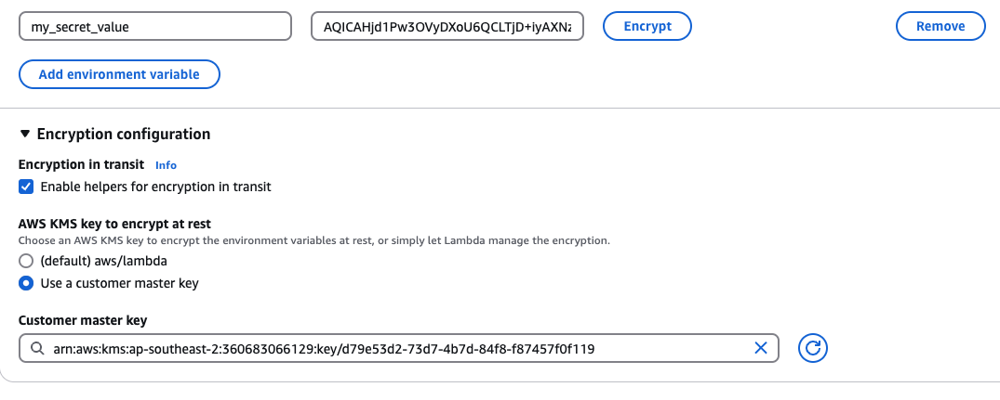

## AWS Lambda Function

AWS Lambda is a compute service that lets you run code without provisioning or managing servers.

- high-availability compute infrastructure
- administration of the compute resources: auto scaling, logging, memory, CPU, network etc.
- you only need to supply your code in one of the language runtime that lambda supports

## Use Cases

For application scenarios that need to scale up rapidly, and scale down to zero when not in demand:

- file processing: use S3 to trigger Lambda after an upload etc.
- stream processing: real-time stream data for application activity tracking, data cleaning, transaction order processing etc.
- web applications: combine Lambda with other AWS services
- IoT backends: build backends using Lambda and Amazon API Gateway to authenticate and process API requests.

## Program model

Lambda scales the function by running additional instances of it as demand increases, and by stopping instances as demand decreases.

This model leads to variations in application architecture, such as:

- Unless noted otherwise, incoming requests might be processed out of order or concurrently.
- Do not rely on instances of your function being long lived, instead store your application's state elsewhere.
- Use local storage and class-level objects to increase performance, but keep to a minimum the size of your deployment package and the amount of data that you transfer onto the execution environment.

## Common triggers

- Alexa (IoT), ApiGateway, Application Load Balancer
- CodeCommit, CloudWatch Logs, EventBridge (CloudWatch Events)
- S3, SNS, SQS
- Apache Kafka, DynamoDB, DocumentDB
- Kinesis, MQ, MSK

## Environment Variables

- an environment variable is a key-pair of strings that are stored in a function's version-specific configuration
- by default, the environment variables are encrypted using the default KMS key for lambda (_aws/lambda_); when the lambda is invoked, those values are decrypted and make available to the code
- all uses that can access the lambda function in the console can see the plain text environment variables

- for storing sensitive information, you can encrypt environment variables by using the console's encryption helper
  - you must use a custom KMS key
  - it adds an additional layer of encryption that obscures secret values in the console and API output
  - your function retrieves the encrypted value from the environment and decrypt it by using the AWS KMS API
  - the function's execution role needs permission to call the AWS KMS API
    
