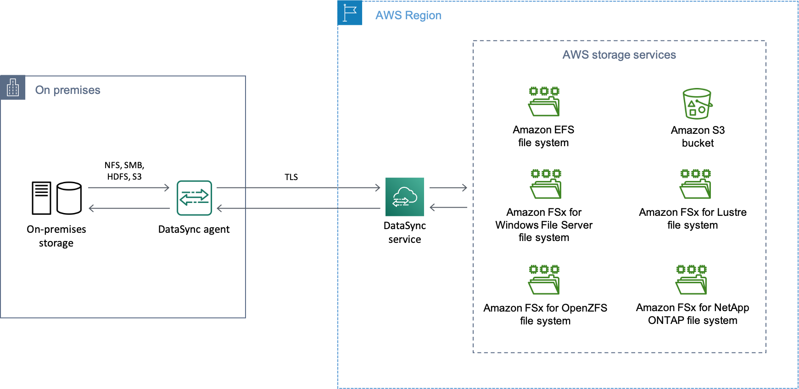
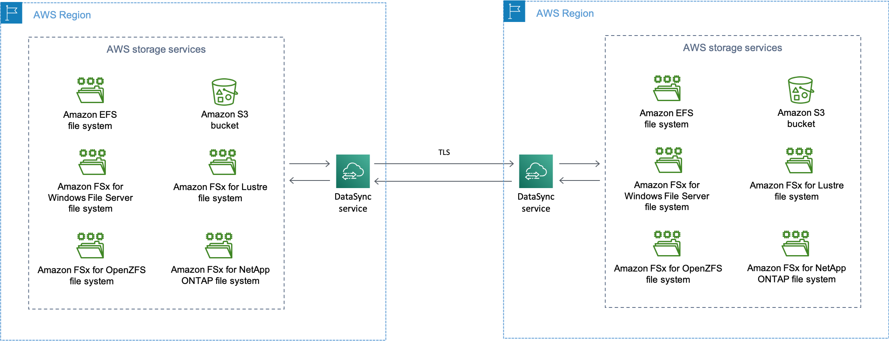
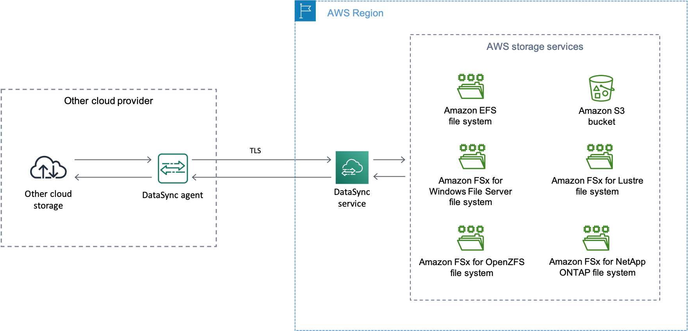

# AWS DataSync

AWS DataSync is an online data transfer and discovery service that simplifies data migration and helps you quickly, easily, and securely transfer your file or object data to, from, and between AWS storage services.

## Transferring between on-premises storage and AWS

- A DataSync agent copying data from an on-premises storage system.
- Data moving into AWS via Transport Layer Security (TLS).
- DataSync copying data to a supported AWS storage service.

## Transferring between AWS storage services

- DataSync copying data from a supported AWS storage service.
- Data moving across AWS Regions via TLS.
- DataSync copying data to a supported AWS storage service.
- Your data remains in AWS network and doesn't traverse the public internet

## Transferring between cloud storage systems and AWS storage services

- Deploy a DataSync agent in your cloud environment
- The data transfer securely through TLS
- The DataSync service writes the data to your AWS storage service

