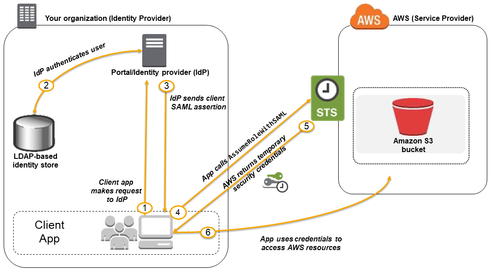
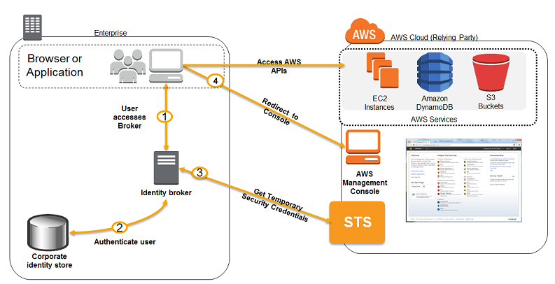

# AWS IAM

## Users and Groups

- IAM: Identity and Access Management, Global service
- Root account: created by default, shouldn't be used or shared
- Users: are people within your organization and can be grouped
  - users don't have to belong to a group
  - users can belong to multiple groups
- Groups: only contains users, not other groups

## IAM permissions

- Users and groups can be assigned JSON documents called policies
- The policies define the permissions of the users
- Least privilege principle: don't give more permissions than a user needs

## IAM policy

```json
{
    "Version": "2012-10-17",
    "Id": "ecs-tag-permissions",
    "Statement": [
        {
            "Sid": "AllowECSTagResource",
            "Effect": "Allow",
            "Principal": {
              "AWS": ["arn:aws:iam::123456789:root"]
            }
            "Action": [
                "ecs:TagResource"
            ],
            "Resource": "*",
            "Condition": {
                "StringEquals": {
                    "ecs:CreateAction": [
                        "CreateCluster",
                        "RegisterTaskDefinition"
                    ]
                }
            }
        }
    ]
}
```

- `Version`: policy language version
- `Id`: an identifier of the policy (optional)
- `Statement`: one or more individual statements (required)
  - `Sid`: an identifier of the statement (optional)
  - `Effect`: whether the statement allows or denies access (Allow/Deny)
  - `Principal`: the account/user/role to which the policy applied to
  - `Action`: list of actions the policy allows or denies
  - `Resource`: list of resources to which the actions applied to
  - `Condition`: conditions for when the policy is in effect (optional)

## IAM Password Policy

- Account settings => Password Policy
  - Password minimum length
  - Password strength
  - Password expiration
  - Allow users to change their own password
  - Prevent password reuse

- MFA: Multi Factor Authentication
  - Virtual MFA device: Google Authenticator, Authy
  - Universal 2nd Factor (U2F) Security Key: YubiKey by Yubico
  - Hardware Key Fob MFA Device: by Gemalto
  - Hardware Key Fob MFA Device for AWS GovCloud (US): by SurePassID

## How users access AWS

- AWS console
- AWS CLI: protected by access key
- AWS SDK: protected by access key
- CloudShell

## IAM roles for services

- Some AWS services will need to perform actions on our behalf, so we will assign permissions to AWS services with **IAM Roles**.
- Common roles:
  - EC2 instance roles
  - Lambda function roles
  - Roles for CloudFormation

Create a role for EC2 to access IAM (readonly), the `trust policy` (Trusted entities) is:

```json
{
  "Version": "2012-10-17",
  "Statement": [
    {
      "Effect": "Allow",
      "Principal": {
        "Service": "ec2.amazonaws.com"
      },
      "Action": "sts:AssumeRole"
    }
  ]
}
```

And the permission is:

```json
{
  "Version": "2012-10-17",
  "Statement": [
    {
      "Effect": "Allow",
      "Action": [
        "iam:GenerateCredentialReport",
        "iam:GenerateServiceLastAccessedDetails",
        "iam:Get*",
        "iam:List*",
        "iam:SimulateCustomPolicy",
        "iam:SimulatePrincipalPolicy"
      ],
      "Resource": "*"
    }
  ]
}
```

## IAM Security Tools

- IAM Credentials Report (account level): lists all your IAM users in this account and the status of their various credentials
- IAM Access Advisor (user level): shows the services that this user can access and when those services were last accessed.

## IAM STS (Security Token Service)

- AWS STS (Security Token Service): create and provide trusted users with temporary security credentials to access AWS resources
  - short-term credentials
  - IAM users, AWS services and federated users can use STS to get temporary security credentials
- the key to using AWS STS is to carefully design the IAM policies and role trust relationships

```json
{
  "Version": "2012-10-17",
  "Statement": [
    {
      "Effect": "Allow",
      "Principal": {
        "Service": "globalaccelerator.amazonaws.com"
      },
      "Action": "sts:AssumeRole"
    }
  ]
}
```

## IAM Best Practices

- Don't use the `root` account except for AWS account setup.
- One physical user = one AWS user
- Assign users to groups and assign permissions to group
- Create a strong password policy
- Use and enforce the use of MFA
- Create and use `roles` for giving permissions to AWS services
- Use `access keys` for programmatic access (CLI/SDK)
- Audit permissions of your account using IAM Credentials Report & IAM Access Advisor
- Never share IAM users and access keys

## MFA

We can create an IAM policy that enforces MFA authentication and attach the policy to an IAM group. All the users in the group are enforced to use MFA.

```json
{
  "Version": "2012-10-17",
  "Statement": [
    {
      "Effect": "Allow",
      "Action": "*",
      "Resource": "*",
      "Condition": {
        "Bool": {
          "aws:MultiFactorAuthPresent": "true"
        }
      }
    }
  ]
}
```

## Identity providers and federation

- If your organization already uses an identity provider software package that supports **SAML 2.0** (Security Assertion Markup Language 2.0), you can create trust between your organization as an identity provider (IdP) and AWS as the service provider. You can then use SAML to provide your users with federated single-sign on (SSO) to the AWS Management Console or federated access to call AWS API operations.
  

- If your identity store is not compatible with SAML 2.0, then you can build a custom identity broker application to perform a similar function.The broker application authenticates users, requests temporary credentials for users from AWS, and then provides them to the user to access AWS resources.
  

- **OIDC** federation
  - we **strongly** recommend that you do **not** store AWS credentials long-term in applications outside AWS.
  - instead, configure your applications to request temporary AWS security credentials dynamically when needed using *OIDC federation*.
  - you can use OIDC in applications, such as GitHub Actions or any other [OpenID Connect (OIDC)](http://openid.net/connect/)-compatible IdP, to authenticate with AWS.

## IAM Identity Center

- IAM Identity Center makes it easy to connect an existing directory or use the built-in Identity Center directory to manage user access to AWS applications and multiple AWS account.
- You can connect your existing identity provider and synchronise users and groups from your directory, or create and manage your uses directly in IAM Identity Center. You can then use IAM Identity Center for either or both of the following:
  - User access to applications
  - User access to AWS accounts
