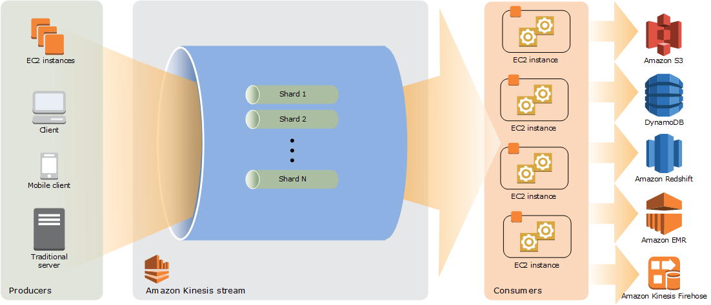
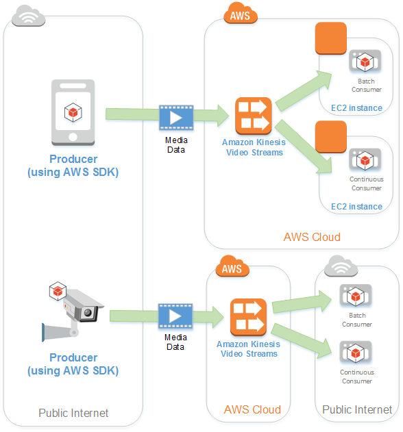

# Kinesis Data Streams

- To collect and process large streams of data records in realtime
- You can use Kinesis Data Streams for rapid and continuous data intake and aggregation. The type of data used can include:
    - IT infrastructure log data, application logs, social media, market data feeds and web click stream data
- A common use is the real-time aggregation of data followed by loading the aggregated data into a data warehouse or map-reduce cluster.
- Multiple Kinesis Data Streams applications (consumers) can consume data from a stream, so that multiple actions can take place concurrently and independently.
- Kinesis Data Streams offer native integration with AWS analytics services such as Amazon EMR, AWS Glue, and Amazon Kinesis Data Analytics. This makes it straightforward to build a robust, scalable pipeline.
- Kinesis Data Streams use shards to scale both the ingestion and the parallel processing, maintaining ordering within each shard.
- Kinesis Data Streams consumers (for instance, Spark on EMR) can read records in batches at their own pace, checkpoint progress, and ensure idempotent processing.
- Kinesis Data Streams store records for a configurable retention period (default 24 hours, extendable up to 7 days), enabling reprocessing or replay if a downstream job fails.

## How it works

## Kinesis Video Streams

- Kinesis Video Stream is a fully managed AWS service that can stream live video from devices to AWS Cloud, or build applications for real-time video processing or batch-oriented video analytics.
- You can capture massive amounts of live video data from millions of sources, including smartphones, security cameras, webcams, cameras embedded in cars, drones, and other sources.
- As live video streams from these sources into a Kinesis video stream, you can build applications to access the data, frame-by-frame, in real time for low-latency processing.
- You can also configure your Kinesis video stream to durably store media data for the specified retention period. Kinesis Video Streams automatically stores this data and encrypts it at rest.

## How it works

## Benefits

- **Connect and stream from millions of devices**
- **Durably store, encrypt and index data**: durably store media data for custom retention periods; also generates an index over the stored data based on timestamps, you appllication can retrieve specified data in a stream using the time-index.
- **Focus on managing application instead of infrastructure**: Kinesis Vide Stream is serverless.
- **Build real-time and batch applications on data streams**
- **Stream data more securely**: encrypts all data as it flows through the service and when it persists the data
- **Pay as you go**
