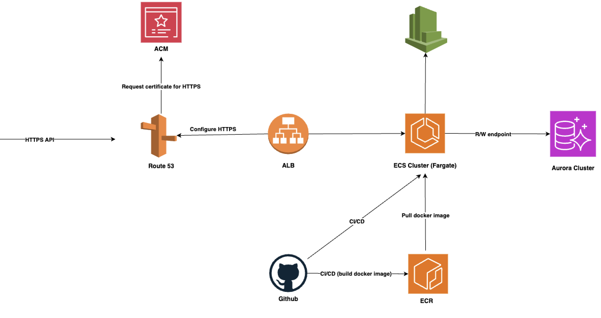

## Introduction

Deploying a Node.js application to AWS can feel overwhelming with so many options available. Whether you're building a REST API, GraphQL service, or full-stack application as part of a microservices architecture, choosing the right deployment strategy can significantly impact your application's performance, cost, and maintainability.

In this comprehensive guide, we'll explore six popular AWS deployment methods for Node.js applications, examining their trade-offs to help you make an informed decision. We'll cover everything from serverless solutions to container orchestration, with practical insights and cost considerations.

## Key Factors to Consider

Before diving into specific deployment methods, consider these factors:

- **Application complexity** and traffic patterns
- **Team expertise** with AWS services and DevOps practices
- **Performance requirements** (latency, throughput)
- **Budget constraints** and cost optimization needs
- **Scaling requirements** (horizontal vs vertical)
- **Operational overhead** tolerance
- **Security and compliance** requirements

## 1. AWS Elastic Beanstalk

AWS Elastic Beanstalk is a Platform as a Service (PaaS) that simplifies deployment and management of web applications. It automatically handles infrastructure provisioning, load balancing, auto-scaling, and application health monitoring.

**Pros:**

- **Rapid Deployment**: Deploy with a simple `eb deploy` command or ZIP file upload
- **Managed Infrastructure**: Automatically provisions EC2 instances, load balancers, and auto-scaling groups
- **Built-in Monitoring**: Integrated with CloudWatch for application and infrastructure metrics
- **Easy Rollbacks**: Simple version management and rollback capabilities
- **Cost-Effective**: No additional charges beyond the underlying AWS resources

**Cons:**

- **Limited Customization**: Less control over the underlying infrastructure configuration
- **Platform Restrictions**: Limited to supported Node.js versions and configurations
- **Vendor Lock-in**: Tightly coupled to AWS Elastic Beanstalk service
- **Debugging Complexity**: Harder to troubleshoot when things go wrong

**Cost Considerations:**
- Pay only for underlying EC2 instances, load balancers, and other AWS resources
- Typically costs $20-200/month for small to medium applications

> **Use Case**: Perfect for development teams wanting quick deployment without deep AWS expertise, prototypes, or applications with predictable traffic patterns.

## 2. AWS Lambda with API Gateway

AWS Lambda enables serverless computing where you run code without managing servers. Combined with API Gateway, it creates a powerful serverless API solution with automatic scaling and pay-per-request pricing.

**Pros:**

- **True Serverless**: Zero server management and automatic scaling
- **Cost Efficient**: Pay only for actual execution time (down to 1ms billing)
- **Automatic Scaling**: Handles 0 to thousands of concurrent requests instantly
- **High Availability**: Built-in fault tolerance across multiple Availability Zones
- **Integrated Security**: Built-in integration with AWS IAM and other security services

**Cons:**

- **Cold Start Latency**: 100-1000ms delay for infrequently called functions
- **Execution Limits**: 15-minute maximum execution time, 10GB memory limit
- **Stateless Architecture**: Requires external storage for persistent data
- **Complex Debugging**: Distributed tracing and debugging can be challenging
- **Vendor Lock-in**: Heavily tied to AWS Lambda ecosystem

**Cost Considerations:**
- Free tier: 1M requests and 400,000 GB-seconds per month
- Beyond free tier: ~$0.20 per 1M requests + compute time
- Can be very cost-effective for low to moderate traffic

**Node.js Specific Considerations:**
- Use Lambda Layers for common dependencies
- Optimize bundle size to reduce cold starts
- Consider using Provisioned Concurrency for consistent performance

> **Use Case**: Ideal for microservices, APIs with variable traffic, event-driven applications, and cost-sensitive projects with sporadic usage.

## 3. Amazon EC2

Amazon EC2 provides virtual servers in the cloud with complete control over the computing environment. You can choose instance types, operating systems, and have full access to configure everything.

**Pros:**

- **Complete Control**: Full access to the operating system and server configuration
- **Flexibility**: Can run any Node.js version, custom software, or legacy applications
- **Predictable Performance**: Dedicated resources without "noisy neighbor" issues
- **Cost Optimization**: Reserved instances and Spot instances for significant savings
- **Hybrid Architectures**: Easily integrate with on-premises infrastructure

**Cons:**

- **Operational Overhead**: Responsible for OS updates, security patches, and maintenance
- **Scaling Complexity**: Manual or complex auto-scaling setup required
- **Security Responsibility**: Must configure security groups, firewalls, and access controls
- **High Learning Curve**: Requires deep AWS and system administration knowledge

**Cost Considerations:**
- t3.micro: ~$8.50/month (free tier eligible)
- t3.medium: ~$30/month
- Reserved instances: 30-70% savings for predictable workloads
- Don't forget costs for storage, data transfer, and load balancers

**Best Practices for Node.js on EC2:**
- Use PM2 or similar process managers
- Implement proper logging and monitoring
- Use Application Load Balancer for high availability
- Consider using Auto Scaling Groups

> **Use Case**: Best for applications requiring specific configurations, legacy systems, long-running processes, or when you need full control over the environment.

## 4. Amazon ECS with Fargate

Amazon ECS (Elastic Container Service) is a fully managed container orchestration service. AWS Fargate is a serverless compute engine that allows you to run containers without managing the underlying infrastructure.

**Pros:**

- **Serverless Containers**: No EC2 instance management required
- **Easy Scaling**: Automatic horizontal and vertical scaling
- **Service Discovery**: Built-in service discovery and load balancing
- **AWS Integration**: Seamless integration with VPC, IAM, CloudWatch, and other AWS services
- **Blue/Green Deployments**: Built-in support for zero-downtime deployments

**Cons:**

- **Container Learning Curve**: Requires Docker knowledge and containerization best practices
- **Cost Premium**: Fargate is more expensive than self-managed EC2 instances
- **Resource Constraints**: Limited to specific CPU/memory combinations
- **Debugging Complexity**: Container debugging can be more complex than traditional deployments

**Cost Considerations:**
- Fargate pricing: ~$0.04048 per vCPU per hour + $0.004445 per GB memory per hour
- A typical Node.js app (0.25 vCPU, 0.5 GB): ~$15-30/month
- ECS on EC2: ~30-50% cheaper but requires instance management

**Node.js Optimization Tips:**
- Use multi-stage Docker builds to minimize image size
- Implement proper health checks
- Use Alpine Linux base images for smaller containers
- Leverage Docker layer caching

> **Use Case**: Perfect for containerized applications, microservices architectures, teams familiar with Docker, and applications requiring consistent deployment across environments.

## 5. Amazon EKS

Amazon EKS (Elastic Kubernetes Service) is a managed Kubernetes service that simplifies running Kubernetes on AWS without managing the control plane.

**Pros:**

- **Kubernetes Ecosystem**: Access to the vast Kubernetes ecosystem and tools
- **Advanced Orchestration**: Sophisticated deployment strategies, service mesh, and networking
- **Multi-Cloud Portability**: Kubernetes knowledge transfers across cloud providers
- **Enterprise Features**: Advanced RBAC, network policies, and compliance features
- **Managed Control Plane**: AWS manages the Kubernetes control plane for high availability

**Cons:**

- **Steep Learning Curve**: Kubernetes complexity requires significant investment in learning
- **High Operational Overhead**: Complex troubleshooting and ongoing maintenance
- **Cost Complexity**: Difficult to predict and optimize costs
- **Over-Engineering Risk**: May be overkill for simple applications

**Cost Considerations:**
- EKS cluster: $0.10 per hour (~$73/month)
- Plus worker node costs (EC2 or Fargate)
- Additional costs for load balancers, storage, and networking
- Minimum realistic cost: $150-300/month

> **Use Case**: Suitable for organizations already using Kubernetes, complex microservices architectures, teams requiring advanced container orchestration, or multi-cloud strategies.

## 6. AWS App Runner (Bonus Option)

AWS App Runner is a newer fully managed service that makes it easy to quickly deploy containerized web applications and APIs at scale.

**Pros:**
- **Simplicity**: Minimal configuration required
- **Automatic Scaling**: Scales based on traffic with no setup
- **Integrated CI/CD**: Direct integration with source code repositories
- **Cost-Effective**: Pay only for running applications

**Cons:**
- **Limited Customization**: Less control compared to ECS/EKS
- **New Service**: Limited track record and ecosystem
- **Regional Availability**: Not available in all AWS regions

> **Use Case**: Great for simple containerized applications that need quick deployment with minimal configuration.

## Decision Framework

Choose based on your priorities:

**🚀 Speed to Market**: Elastic Beanstalk or App Runner
**💰 Cost Optimization**: Lambda (variable traffic) or EC2 (predictable traffic)
**🏗️ Microservices**: ECS/Fargate or Lambda
**🔧 Maximum Control**: EC2 or EKS
**📦 Container Strategy**: ECS/Fargate (simple) or EKS (advanced)

## Updated Comparison Table

| Method               | Ease of Use | Management Overhead | Scalability | Cost  | Control | Best For                          |
| -------------------- | ----------- | ------------------- | ----------- | ----- | ------- | --------------------------------- |
| Elastic Beanstalk    | ⭐⭐⭐⭐⭐       | ⭐⭐                  | ⭐⭐⭐⭐        | ⭐⭐⭐   | ⭐⭐⭐     | Quick deployment, prototypes      |
| Lambda + API Gateway | ⭐⭐⭐⭐        | ⭐                   | ⭐⭐⭐⭐⭐       | ⭐⭐⭐⭐⭐ | ⭐⭐      | Variable traffic, microservices   |
| EC2                  | ⭐⭐⭐         | ⭐⭐⭐⭐⭐               | ⭐⭐⭐⭐        | ⭐⭐⭐   | ⭐⭐⭐⭐⭐   | Custom requirements, legacy apps  |
| ECS/Fargate          | ⭐⭐⭐         | ⭐⭐                  | ⭐⭐⭐⭐⭐       | ⭐⭐⭐   | ⭐⭐⭐⭐    | Containerized apps, microservices |
| EKS                  | ⭐⭐          | ⭐⭐⭐⭐⭐               | ⭐⭐⭐⭐⭐       | ⭐⭐    | ⭐⭐⭐⭐⭐   | Complex orchestration, enterprise |
| App Runner           | ⭐⭐⭐⭐⭐       | ⭐                   | ⭐⭐⭐⭐        | ⭐⭐⭐   | ⭐⭐      | Simple containerized apps         |

## My Recommendation: ECS/Fargate

After working with various AWS services for over 3 years and deploying multiple Node.js applications, I recommend **ECS with Fargate** for most scenarios because:

**✅ Sweet Spot Benefits:**
- **Container-Native**: Leverages Docker for consistent deployments across environments
- **Serverless Infrastructure**: No EC2 instance management while retaining container benefits
- **AWS Integration**: Seamless integration with ALB, RDS, ElastiCache, and other AWS services
- **Predictable Scaling**: Reliable auto-scaling without cold start issues
- **Cost-Effective**: Reasonable pricing for most production workloads

**🎯 Perfect For:**
- Production Node.js APIs and microservices
- Teams comfortable with Docker containerization
- Applications requiring consistent performance
- Projects needing good AWS service integration

**📊 Real-World Example:**
Here's the architecture I use for a Node.js REST API serving 10,000+ requests/day:

The following diagram shows my recommended ECS/Fargate deployment architecture:

## Conclusion

The right deployment method depends on your specific needs, team expertise, and project requirements. Start with your constraints (budget, timeline, team skills) and work backward to the solution that best fits.

For most Node.js applications, I'd recommend this progression:
1. **Prototype**: Start with Elastic Beanstalk or App Runner
2. **Production**: Move to ECS/Fargate for reliability and scalability
3. **Scale**: Consider Lambda for specific microservices or EKS for complex orchestration

Remember: you can always start simple and evolve your architecture as your application and team mature. The key is to choose a solution that you can successfully operate and maintain long-term.